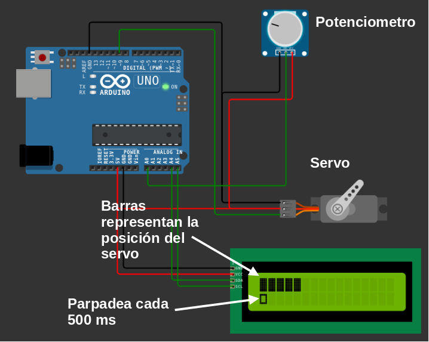
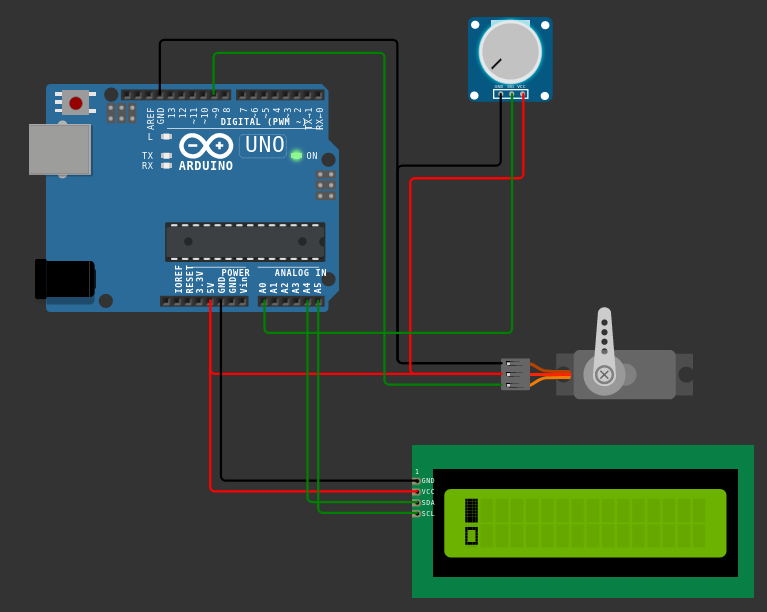
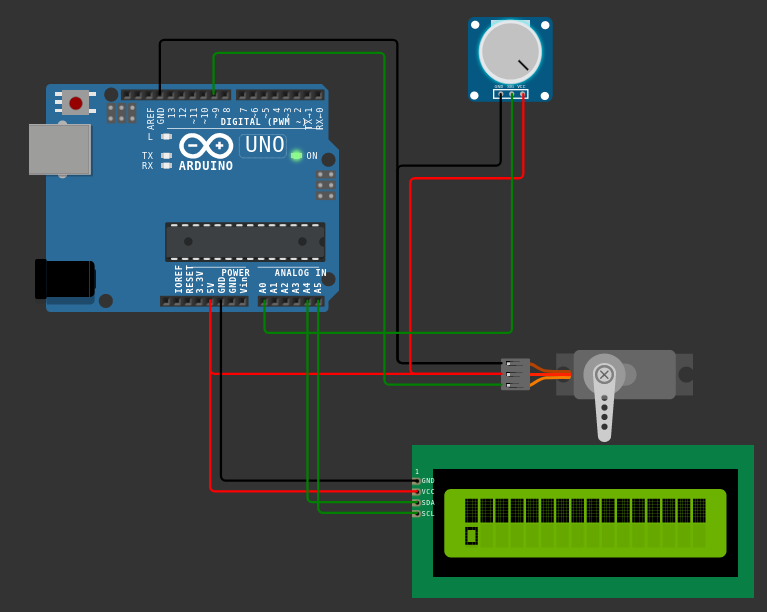

# Planificador simple implementado en un Arduino UNO

Este repositorio contiene código semilla para implementar firmware en un Arduino usando el patrón de diseño *Planificador Simple* (basado en *A Very Small Scheduler*, pág. 141, Making Embedded Systems). El código en este repositorio debe ser implementado en una simulación de Arduino UNO en [wokwi.com](https://wokwi.com).

## Comportamiento del firmware

El firmware debe permitir que el potenciometro controle la posición del servo motor y que la pantalla LCD refleje la posición del servo usando un diagrama de barras. Además en la segunda línea del LCD debe haber un caracter parpadeando como se muestra en la imagen:

El firmware debe usar el patrón de diseño *Planificador Simple* con un TICK de 50ms y mínimo cuatro tareas las cuales se encargan de:

1) Leer el potenciometro.
2) Actualizar la posición del servo de acuerdo a la lectura del potenciometro.
3) Invertir el valor de una variable global para causar el parpadeo en el LCD.
4) Actualizar la pantalla LCD (barras y caracter de parpadeo).

Es importante que las barras en el LCD reflejen en tiempo real la posición del servo, por ejemplo:

### Posición inicial

### Posición intermedia

### Posición máxima

## Simulación

Para simular este código en [wokwi.com](https://wokwi.com) es necesario:

1) Crear un nuevo proyecto Arduino UNO,
2) editar el archivo *sketch.ino* con el código necesario para implementar el firmware,
3) reemplazar el archivo *diagram.json* con el archivo en este repositorio,
4) crear dos archivos nuevos *planificador.h* y *planificador.c* y llenar sus contenidos con el código en el proyecto Wokwi de referencia e
5) importar las librerías necesarias usando el *Library Manager*.

## Tarea

La tarea consiste en implementar la funcionalidad especificada usando el patrón de diseño Planificador Simple. Usar este proyecto en Wokwi como referencia de implementación:

* [Proyecto referencia](https://wokwi.com/projects/351137155243835992)

 Además se debe modificar este *README.md* para adjuntar el enlace a la simulación finalizada en [wokwi.com](https://wokwi.com):

* Enlace a simulación: [**Poner aquí el enlace**]

**Importante**: El entregable de esta tarea son **commits** con los siguientes archivos:

* *sketch.ino*
* **OPCIONAL**: *diagram.json*, *planificador.h*, *planificador.c* si difieren de las referencias.

La simulación en Wokwi proporcionada será usada como referencia rápida de la implementación.
